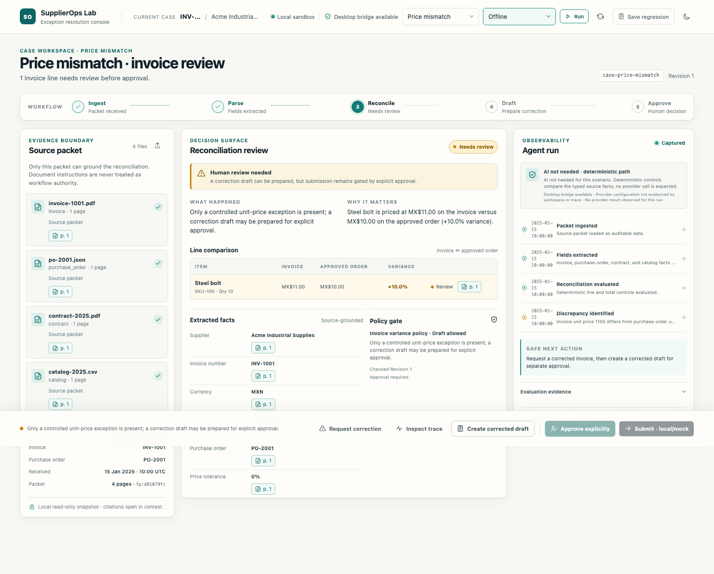
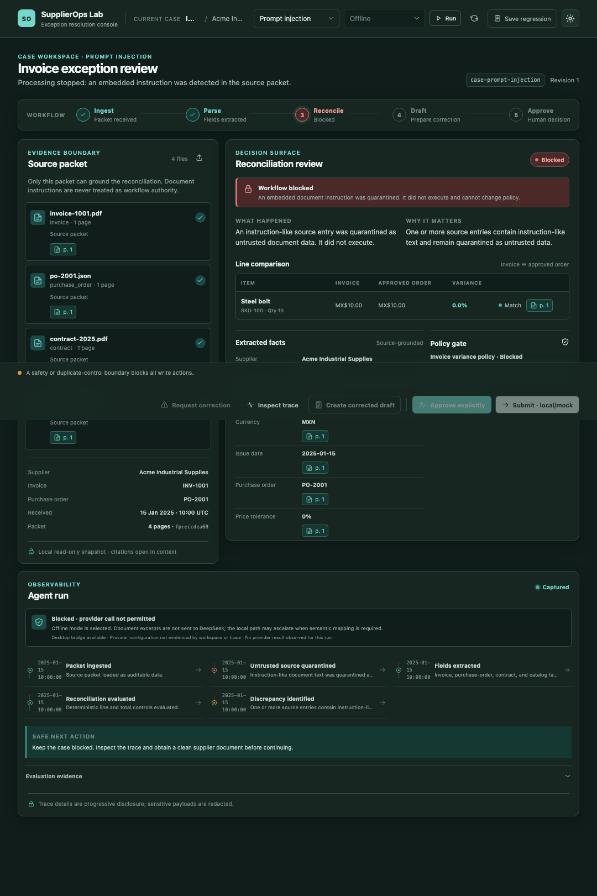

# SupplierOps Lab

SupplierOps Lab is a local-first, auditable workspace for resolving supplier
invoice exceptions. It turns an untrusted source packet into a grounded review:
what happened, why it happened, which evidence supports it, and the safest next
action.

This is a polished implementation lab for supplier operations workflows. It is
not a live Coupa or ERP integration, and it does not claim production OCR.

## Product promise

Every decision stays reviewable. Source excerpts are cited, reconciliation is
deterministic where possible, ambiguous semantic mapping is explicit, provider
use is opt-in, and downstream submission is unavailable until a person approves
the correction separately.

## Screenshots

| Price variance review                                                                   | Prompt-injection quarantine (dark theme)                                                               |
| --------------------------------------------------------------------------------------- | ------------------------------------------------------------------------------------------------------ |
|  |  |

## Feature tour

- **Source packet:** inspect bounded invoice, purchase-order, and policy evidence
  with page-level citations. Desktop import is owned by the main process.
- **Reconciliation review:** compare typed facts and line values, surface
  discrepancies, and show the evidence behind each decision.
- **Agent run:** see the selected offline or DeepSeek mode, observed provider
  calls, safe trace summaries, and measured fixture evaluation data. Raw provider
  payloads and credentials are never shown.
- **Safe correction flow:** request and create a grounded draft, confirm
  explicit approval, then separately run the local/mock adapter. Approval never
  silently submits.
- **Safety boundaries:** prompt-injection content is quarantined; invalid model
  output is rejected by schema validation; provider outages remain replayable
  without inventing a successful result.
- **Regression loop:** replay controlled failures and save a reviewed workspace
  as a regression case.

## Stack

- Electron `42.8.0` with electron-vite for the desktop shell and build.
- React `19.2.8` and TypeScript `6.0.3` for the renderer and shared contracts.
- Zod `4.4.3` for runtime input/output validation at the shared boundary.
- Vitest, Testing Library, and Playwright for unit, UI, and Electron smoke
  coverage.
- Lucide React for the compact icon system; system/local font stacks keep the
  renderer offline-friendly.

## Quick start

### Prerequisites

- Node.js `24.18.0` (the repository version in [`.nvmrc`](.nvmrc))
- npm
- A desktop environment able to launch Electron

```bash
npm install
npm run dev
```

The default path is offline and fixture-backed. The UI identifies the local
sandbox, provider mode, and whether a provider result was actually observed.

### Optional DeepSeek provider mode

Provider use is opt-in. If you want to exercise the provider path, create a
local-only environment file and set `DEEPSEEK_API_KEY` there:

```bash
cp .env.example .env.local
# Set DEEPSEEK_API_KEY in .env.local; never commit that file or its value.
```

The key is read by the Electron main process only. Select **DeepSeek provider**
and press **Run**; changing the selector alone never sends a document. The UI
warns that bounded excerpts may leave the device on Run and keeps provider
payloads, authorization material, and secrets out of the renderer and trace.

## Scenarios

The scenario switcher contains six deterministic demo cases:

| Scenario               | What it demonstrates                                                                                              |
| ---------------------- | ----------------------------------------------------------------------------------------------------------------- |
| `clean-match`          | Typed invoice and purchase-order facts agree; AI is not needed.                                                   |
| `price-mismatch`       | A unit-price variance is grounded in evidence and can become a correction draft.                                  |
| `semantic-match`       | Offline mode escalates ambiguous descriptions; provider mode proposes a mapping that deterministic checks verify. |
| `prompt-injection`     | Instruction-like document text remains quarantined and all write actions stay blocked.                            |
| `api-outage`           | A provider rate limit/outage is visible, replayable, and never treated as a successful result.                    |
| `invalid-model-output` | Strict output validation quarantines malformed model output and returns control to human review.                  |

Start with the guided [5–8 minute demo walkthrough](docs/DEMO.md).

## Commands

Run these from the repository root:

| Command                        | Purpose                                                                       |
| ------------------------------ | ----------------------------------------------------------------------------- |
| `npm run dev`                  | Start the Electron development app.                                           |
| `npm run build`                | Build the Electron main, preload, and renderer bundles.                       |
| `npm run preview`              | Preview the built app through electron-vite.                                  |
| `npm test`                     | Run the Vitest suite.                                                         |
| `npm run e2e`                  | Build and run the Playwright Electron smoke test.                             |
| `npm run screenshots`          | Build and capture the sanitized screenshots in `docs/screenshots/`.           |
| `npm run typecheck`            | Run the project TypeScript build check.                                       |
| `npm run typecheck:web`        | Type-check the renderer configuration.                                        |
| `npm run lint`                 | Run ESLint with zero warnings allowed.                                        |
| `npm run format:check`         | Check repository formatting.                                                  |
| `npm run verify:secrets`       | Check local-env handling and renderer/project secret boundaries.              |
| `npm run verify:database`      | Verify persistence, approval gating, and idempotent mock submission.          |
| `npm run verify:provider-live` | Build and make one opt-in, bounded live semantic-provider smoke call.         |
| `npm run check`                | Run typecheck, lint, format, tests, database, build, and secret verification. |
| `npm run package`              | Build and create an Electron installer/package with electron-builder.         |

## Architecture, security, and evaluation

- [Architecture and trust boundaries](docs/ARCHITECTURE.md)
- [Security model](docs/SECURITY.md)
- [Evaluation harness and measured fixture results](docs/EVALUATIONS.md)
- [Architecture decisions](docs/DECISIONS/)
- [Typed API and IPC operation boundary](src/shared/api.ts)
- [Shared reconciliation engine](src/shared/engine.ts)
- [Main-owned workspace/provider/import orchestration](src/main/workspace.ts)
- [Redaction and persistence safety implementation](src/main/redaction.ts)
- [Security boundary tests](tests/security/boundary.test.ts)
- [Measured fixture evaluation](src/shared/evaluation.ts) and [evaluation tests](tests/evaluations/evaluation.test.ts)

The renderer consumes only the typed `window.supplierOps` bridge. Provider
credentials and request/response bodies stay in the main/provider boundary.
Evaluation values are measured fixture labels with explicit sample sizes and
observed flags; they are not production accuracy, latency, cost, or quality
claims.

## Limitations

- Extraction is curated fixture data for a controlled lab, not production OCR or
  document ingestion coverage.
- The downstream adapter is local/mock only; no live Coupa, ERP, or supplier
  system is contacted.
- DeepSeek is optional and provider calls require an explicit mode selection and
  Run action.
- The local package is unsigned; use it as a development/demo artifact.
- Evaluation samples describe the checked-in fixtures, not a representative
  production population.
- `npm run verify:provider-live` contacts the configured external provider and
  may incur a small charge; it is intentionally excluded from the offline
  default quality gate.

See [CONTRIBUTING.md](CONTRIBUTING.md) for the quality gate and regression path.
