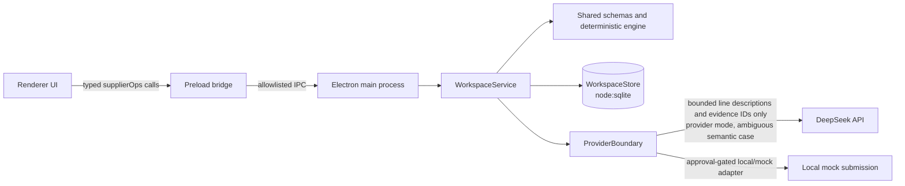

# SupplierOps Lab architecture

SupplierOps Lab is a local-first Electron application for auditable invoice
exception review. The main process owns sensitive capabilities and persistence;
the renderer receives a small typed API and presentation-shaped workspace data.
The shared package owns domain schemas, deterministic reconciliation, and the
approval state machine.

## Process and data flow

The normal path is:

1. `app://bundle` loads the built renderer through the registered custom
   protocol. A loopback URL is accepted only for development.
2. The renderer calls one of the nine operations in `ApiContract`. Preload
   forwards only the matching fixed IPC channel.
3. Main validates the sender, parses the operation input, runs the
   `WorkspaceService` operation, and validates the success output before it
   returns.
4. `WorkspaceService` invokes shared schemas and the deterministic engine,
   persists a bounded projection, and returns the validated workspace.
5. Provider mode can add a semantic suggestion for the genuinely ambiguous
   semantic-match scenario. The engine remains authoritative and verifies the
   suggestion against line facts, monetary controls, currency, and evidence.

## Trust boundaries

| Boundary                        | What crosses it                                                                                | Controls                                                                                                                  |
| ------------------------------- | ---------------------------------------------------------------------------------------------- | ------------------------------------------------------------------------------------------------------------------------- |
| Renderer → preload              | User interface method calls                                                                    | `contextIsolation`, sandbox, no Node integration, frozen `supplierOps` object                                             |
| Preload → main                  | Fixed IPC operation plus schema-shaped input                                                   | Channel allowlist, trusted main-frame check, strict Zod input/output parsing                                              |
| File chooser → main             | Selected file metadata and a bounded text preview                                              | Main-owned chooser, 1–4 files, supported extensions, per-file and aggregate byte limits, basename only                    |
| Document data → engine/provider | Untrusted facts, line descriptions, and evidence IDs                                           | Strict schemas, instruction-like source quarantine, no quarantined content in provider prompt, deterministic revalidation |
| Main → local database           | Sanitized workspace and diagnostic projections                                                 | One `WorkspaceStore` writer queue, versioned schema, size bounds, secret redaction                                        |
| Main → external provider        | Only bounded semantic line objects when provider mode is explicitly used for an ambiguous case | Main-only key, non-streaming JSON request, timeout/retry policy, strict `ModelOutputSchema`, sanitized trace metadata     |
| Approval → submission           | An approved correction draft and idempotency key                                               | Separate approval transition, mock/local adapter, idempotent submission record; no live Coupa write                       |

Document excerpts are data, never control instructions. The shared engine
quarantines instruction-like source content and excludes quarantined content
from provider interpretation. A quarantined or otherwise unsafe case cannot
create a correction draft or proceed to approval/submission.

## Electron shell and renderer isolation

`src/main/index.ts` creates one `BrowserWindow` with:

- `contextIsolation: true`
- `sandbox: true`
- `nodeIntegration: false`
- `webSecurity: true`
- `allowRunningInsecureContent: false`

The minimum window width is 960px so the existing enterprise-desktop
responsive layout can activate. The app uses the privileged `app://bundle`
scheme and resolves renderer assets inside the build output without allowing
path traversal.

The main process denies `window.open`, navigation, frame navigation, redirects,
and webview attachment. The default session denies permission requests and
permission checks. The app-protocol response applies a restrictive CSP with
self-only scripts and connections, no objects, and no framing.

The preload bridge exposes only `window.supplierOps`, implementing the shared
`ApiContract` operations:

`bootstrap`, `loadScenario`, `runScenario`, `createCorrectionDraft`,
`approveDraft`, `submitDraft`, `replayFailure`, `saveRegression`, and
`importSourcePacket`.

The raw `ipcRenderer`, filesystem APIs, environment values, database handles,
and arbitrary channels are not exposed. A main-process error is reduced to the
bounded `{ error: { name, message, failureId } }` envelope; preload converts
that envelope into a detectable `SupplierOpsIpcError` without forwarding a
stack or original payload.

## IPC and runtime validation

`src/shared/api.ts` defines the operation names, channel allowlist, and paired
input/output schemas. `src/main/ipc.ts` performs the following for every
handler:

1. Require a sender frame equal to the sender's main frame.
2. Accept the production `app://bundle` origin or the configured localhost
   development origin only.
3. Parse the input with the operation's strict schema.
4. Run the main-owned operation.
5. Parse the success output with the operation's strict schema.
6. On failure, return only a redacted diagnostic envelope with a stable failure
   ID.

The source import operation is intentionally chooser-owned. Its shared input
contains only `{ caseMetadata, at }`; file paths never cross IPC. The main
dialog allows one to four `.json`, `.csv`, `.tsv`, `.txt`, `.xml`, `.md`, or
`.pdf` files. Each file is limited to 8 MiB and the packet is limited to 32
MiB. The returned projection contains basename, extension, byte size, and a
bounded text preview. `WorkspaceService` creates one untrusted source entry
and non-authoritative bounded-preview evidence item per selected file.
Filename heuristics may classify a source as invoice, purchase order, contract,
or catalog; this classification is not extraction authority.

## Main-owned workspace and persistence

`WorkspaceService` is the production orchestration layer. It loads or runs
fixture scenarios, imports source packets, persists workspaces, creates
correction drafts, records explicit approval, submits through the mock adapter,
replays failures, and saves regression projections. Shared `CaseWorkspace` and
operation schemas are parsed at the boundary and again before persistence or
return.

`WorkspaceStore` uses Node's built-in `node:sqlite` `DatabaseSync`; no native
SQLite package is used. The database is stored at
`app.getPath('userData')/supplierops.sqlite`. Its versioned local schema is
currently version 1 and contains `app_meta` plus `workspace_records` and an
updated-at index. Opening the database configures:

- a 5-second constructor/busy timeout;
- foreign-key enforcement;
- WAL journaling;
- `synchronous = FULL`;
- `trusted_schema = OFF`;
- `allowExtension = false`;
- a startup `quick_check`.

All writes pass through the store's single promise queue. Projections are
sanitized, redacted, and capped at 256 KiB before they are serialized.

## Deterministic reconciliation and provider responsibilities

The shared engine is authoritative for schema validation, evidence references,
line matching, quantity/price/amount/currency controls, duplicate checks,
policy decisions, and correction eligibility. Production document parsing is
not implemented in this checkpoint: fixture scenarios supply curated typed
facts, while imported packets remain bounded, untrusted source entries until a
parser is added. Monetary values are integer minor units; the provider never
supplies monetary corrections or policy decisions.

Offline mode performs no provider call. Provider mode still remains
deterministic for clean matches, price mismatches, prompt-injection cases, and
explicit outage/invalid-output replay fixtures. Only an ambiguous
`semantic-match` run without an explicit fixture result invokes
`ProviderBoundary`.

The real adapter uses DeepSeek's chat-completions endpoint with model
`deepseek-v4-flash`, disabled thinking, non-streaming JSON mode, a 15-second
timeout, and at most one bounded retry for network, 429, 5xx, empty, or invalid
output conditions. Authentication and other non-retryable client failures are
not retried. The prompt contains only bounded invoice/PO line objects with
`lineId`, description, and validated evidence IDs. Provider output is parsed as
JSON and strictly validated with `ModelOutputSchema`; invalid output is
quarantined as a sanitized failure and never becomes a control decision.

The trace projection contains only provider, model, operation, attempt count,
response status class, latency, observed token counts, and a labeled cost
estimate. Missing token counts are reported as `not observed`; an unavailable
provider is reported as `unavailable`. Request text, response text, headers,
keys, key fragments, and private identifiers are not persisted.

No configured key means no network call. The adapter returns a stable
provider-unavailable result, and the engine records that no decision was
inferred. The provider key is loaded only in main from the allowlisted
`DEEPSEEK_API_KEY` environment value or main-owned `.env.local` parsing.
Renderer Vite configuration permits only `VITE_PUBLIC_` variables and points
at an empty renderer env directory; preload and renderer code do not receive
the provider key.

## Approval and downstream boundary

Creating a correction draft, approving it, and submitting it are separate
state transitions. Policy gates are evaluated before draft creation, explicit
human approval is required before submission, and the downstream adapter is a
typed local/mock adapter with idempotency records and replayable failure
records. This checkpoint does not claim a live Coupa integration or perform an
external downstream write.

When provider mode is used, external processing is disclosed: bounded semantic
line descriptions and evidence IDs may be sent to DeepSeek for the ambiguous
semantic-match interpretation. No amounts, totals, policy, approval, access,
commands, submission instructions, quarantined excerpts, raw documents, or
credentials are sent. Offline mode and all deterministic scenarios stay local.

## Failure, redaction, and verification

`redactSensitiveText` removes configured secrets, bearer values, common
credential assignments, token-like values, query secrets, and private-key
blocks. The store registers the configured provider secret for projection-wide
redaction. `redactError` returns only bounded name/message text and a stable
16-character failure ID derived from the redacted values.

The security and provider tests cover sender/origin checks, isolation settings,
error-envelope handling, path-free packet import, redaction, provider retries,
strict model output, no-key no-network degradation, and trace sanitization.
The Electron smoke test builds the production shell, asserts the real
`window.supplierOps` bridge, and drives the price-mismatch draft/approval/
submission separation through the DOM with a fresh temporary user-data
directory.

## Reuse map

SupplierOps Lab carries forward only generic, user-owned conventions from the
hdve-monitoring work: a familiar Electron main/preload/renderer split,
main-owned sensitive operations, strict runtime schemas, local persistence,
auditable traces, deterministic controls, and explicit approval gates.

It deliberately does not copy HDVE branding, domain names, invoice schemas or
fixtures, source data, credentials, provider integrations, or downstream
claims. SupplierOps-specific schemas, IDs, fixtures, UI language, and the
DeepSeek boundary are defined in this repository.
